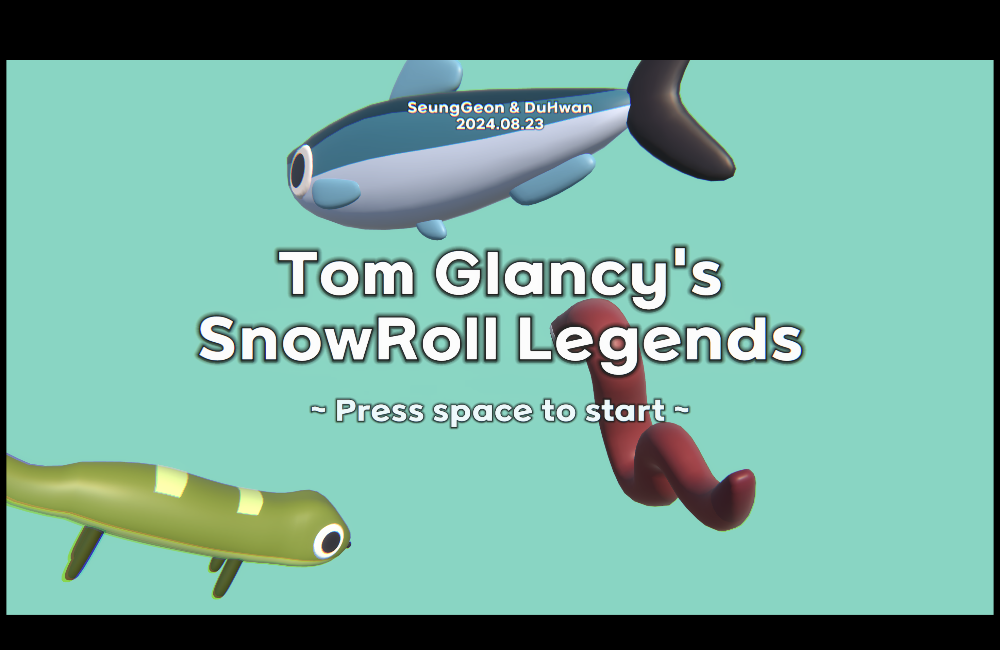
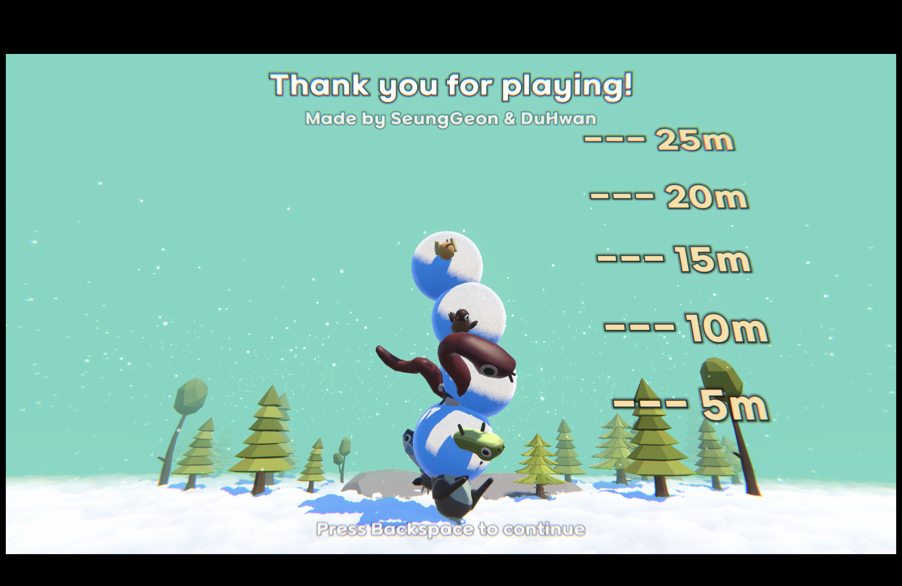
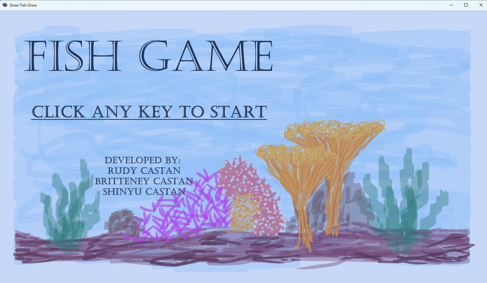
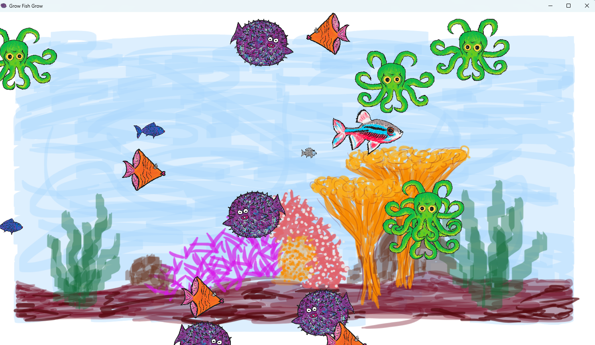
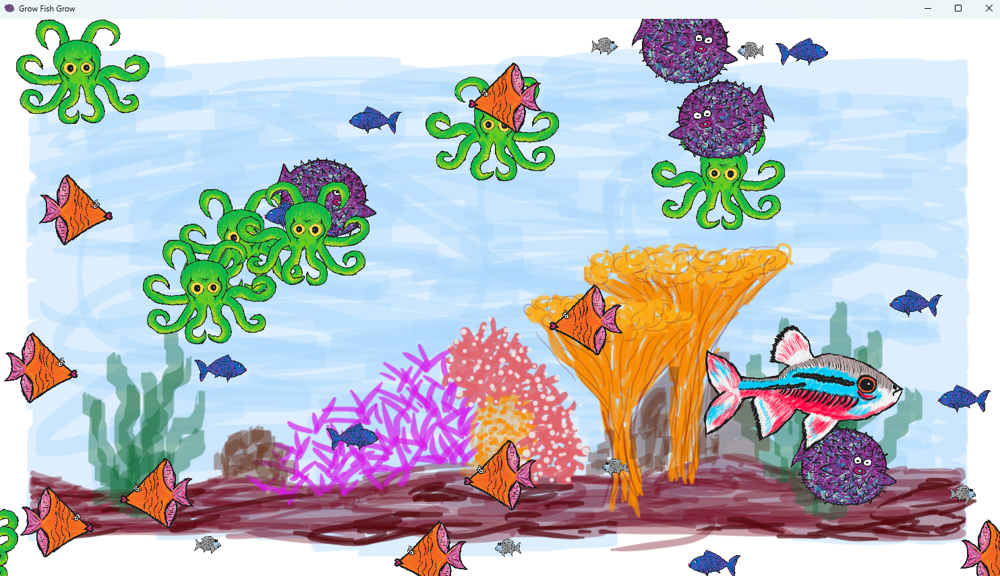
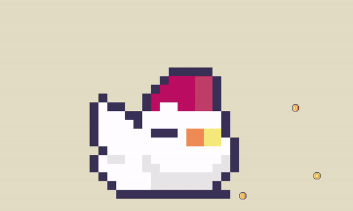
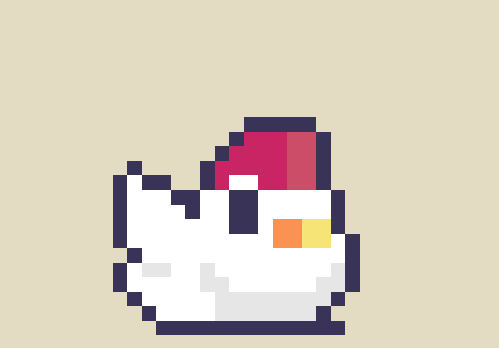

# DigiPen Korea Game Jam Summer 2024

## Theme

> Start Small

## Submitted Games

### Tom Glancy's SnowRoll Legends - Together Edition

~ Art, Programming, Sound Design, etc ~

    SeungGeon Kim, DuHwan Kim

~ The Story ~

    It's winter in the year 2077, and you decided to make a giant snowman so that you can get popular and somehow win the presidential election of the United States.

But you figured out that normal snowman won't just do, and you needed something different.

Following your parent's advice, you decided to roll a snowball with animals in it, and make a super duper snowman then upload it to instagram! 

[Windows LowPoly Version](snowroll/Lowpoly%20Ver.zip)

[Windows HighPoly Version](snowroll/Highpoly%20Ver.zip)
 
~ Controls ~

    WASD to move
    O to enter snowman building mode
    SPACE to drop snowball during snowman building mode

In the game, each time you drop the snowball to build a snowman, you must 'start' rolling a new, 'small' snowball from the beginning. As you roll it, the snowball gradually grows larger, symbolizing the progress you make with your efforts.

### Grow Fish Grow

Team Members
	Rudy Castan
	Britteney Castan
	Shinyu Castan

Start as a small fish and eat other small fish to get bigger!
If you get eaten by a bigger fish than it is game over.

Use Arrow Keys to move around. Space bar to pause the game.

[Play the Web Version Here](fishgame/index.html)

[Download the Windows Version Here](fishgame/GrowFishGrow.zip)

## Raising Hen

Name of Team:
Incredible Team

Members:
Only Jonathan Holmes

Intro:
In an external dimension, far from our own, there exists a hen that far surpasses any beauty that could exist within our own realm. Do not assume that this fowl is fowl. She is elegant and amazing. So much so that she is able to grow the more that you shower her with your love (and cash)!

Instructions:
Use the Left and Right arrow key to move the beautiful and amazing hen left and right. :) Collect coins to grow!

How does this reflect the theme?
Come on. Let's be real. This is an extradimensional being that needs no approval. She'll grow no matter what you do and will soon take over her own realm, and move onto ours as her own domain. Even if you stop playing, she'll continue to grow. But, don't fear her.

[Windows Version Here](raisinghen/Raising%20Hen.zip)

