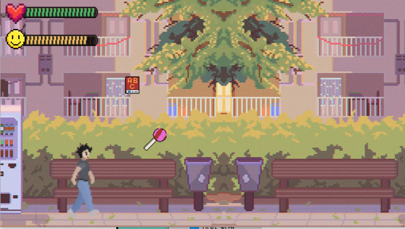

# DigiPen Korea Game Jam Summer 2024

## Theme

> Start Small

## Submitted Games

### Tom Glancy's SnowRoll Legends - Together Edition

~ Art, Programming, Sound Design, etc ~

SeungGeon Kim, DuHwan Kim

~ The Story ~

It's winter in the year 2077, and you decided to make a giant snowman so that you can get popular and somehow win the presidential election of the United States.

But you figured out that normal snowman won't just do, and you needed something different.

Following your parent's advice, you decided to roll a snowball with animals in it, and make a super duper snowman then upload it to instagram! 

[Windows LowPoly Version](snowroll/Lowpoly%20Ver.zip)

[Windows HighPoly Version](snowroll/Highpoly%20Ver.zip)
 
~ Controls ~

WASD to move
O to enter snowman building mode
SPACE to drop snowball during snowman building mode

In the game, each time you drop the snowball to build a snowman, you must 'start' rolling a new, 'small' snowball from the beginning. As you roll it, the snowball gradually grows larger, symbolizing the progress you make with your efforts.

### Grow Fish Grow

Team Members
	Rudy Castan
	Britteney Castan
	Shinyu Castan

Start as a small fish and eat other small fish to get bigger!
If you get eaten by a bigger fish than it is game over.

Use Arrow Keys to move around. Space bar to pause the game.

[Play the Web Version Here](fishgame/index.html)

[Download the Windows Version Here](fishgame/GrowFishGrow.zip)

### Raising Hen

Name of Team:
Incredible Team

Members:
Only Jonathan Holmes

Intro:
In an external dimension, far from our own, there exists a hen that far surpasses any beauty that could exist within our own realm. Do not assume that this fowl is fowl. She is elegant and amazing. So much so that she is able to grow the more that you shower her with your love (and cash)!

Instructions:
Use the Left and Right arrow key to move the beautiful and amazing hen left and right. :) Collect coins to grow!

How does this reflect the theme?
Come on. Let's be real. This is an extradimensional being that needs no approval. She'll grow no matter what you do and will soon take over her own realm, and move onto ours as her own domain. Even if you stop playing, she'll continue to grow. But, don't fear her.

[Windows Version Here](raisinghen/Raising%20Hen.zip)

### RE:Digipen

#### Names of team members

Hanseo Park - UI Design, Pixel Art Design, Animation
Hyunwoo Sung - Game Balancing & Test, PPT
Seungmin Hong - Team Leader, Coding
*Junhyeong Kim* - God of Jecheon, Advice in Game Dev

#### Brief Intro to Game

Our game is called 'RE:Digipen'. 
The main character of this game is a Digipen student who never studied english or coding for the entire year.
In order to go to Redmond, he has to get a good grade. 
To achieve his goal, he starts on his journey of studying english and coding, as well as self-management. 

#### How to interact with the Game

Space-Bar : Jump
Default Stats : Health 7 / Happiness 7

Lollipop : Health + 1 /  Happiness + 1
Exercise : Helath + 2
Energy Drink : Health - 2 / Happiness + 2
Hamburger : Health - 2 / Happiness + 2
EnglishBook : English + 1 / Happiness - 2
Computer : Coding + 1 / Happiness - 2 

* There's a mid check from the professor around 45 seconds from game start.
Don't be upset and quit the game when you see fail because it's just a mid-check :)

#### Describe how the game reflects the theme

Our game RE:Digipen reflects the theme 'Start Small' by the increase of stats. 
There are basically two stats where you need to score high in order to achieve the goal of the game, while on the other hand, there are also two stats where you have to manage so that you do not trip down from this long race. Although our protagonist starts from a small jump, he furthermore become a better person in many areas thanks to those small movements. While there isn't such visual appearance of starting small, it still represents the theme thoroughly.

[Windows Version Here RAR Part 1](redigipen/REdigipen.part1.rar) and [Windows Version Here RAR Part 2](redigipen/REdigipen.part2.rar)

### Paw-Some Adventure

Development: SeoJin Yun

Art: ChanWoong Moon

Game intro: A game in which a cat discovers different items and grows to fight and defeat a boss cat.

A to move Left
D to move Right
W to Jump
E to interact

Theme

"Start Small" is represented by a small cat with no abilities that gradually grows and develops abilities.

[Windows Version Here](pawsome/Paw-Some%20Adventure.zip)
