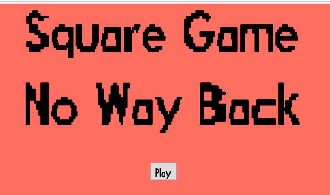
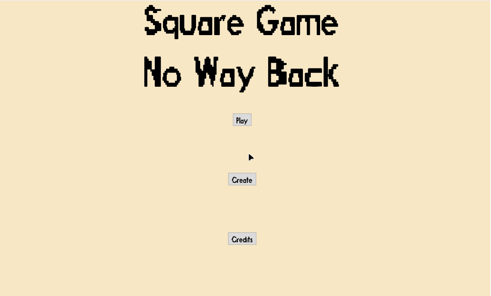
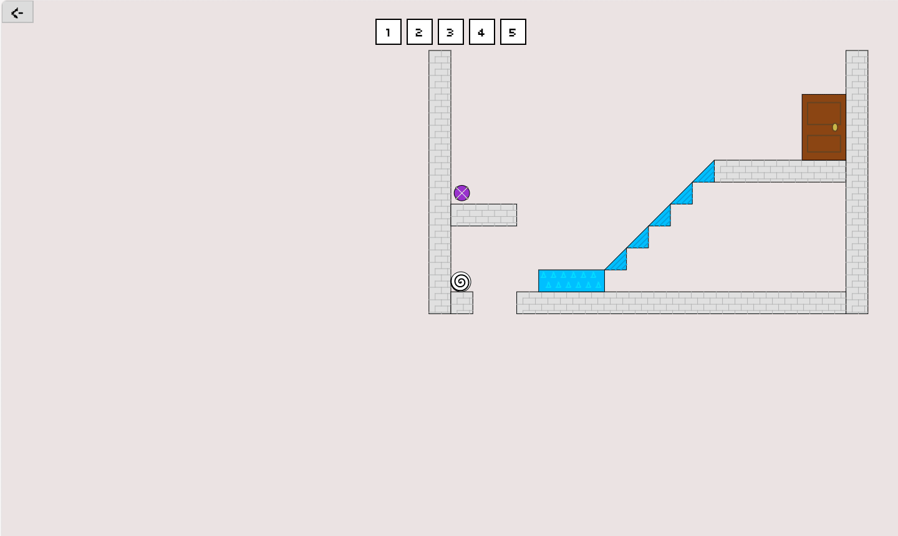
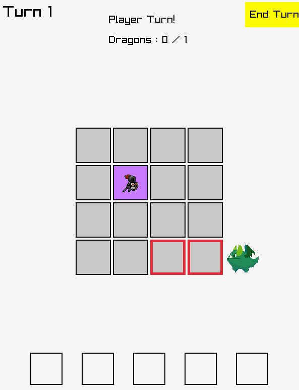
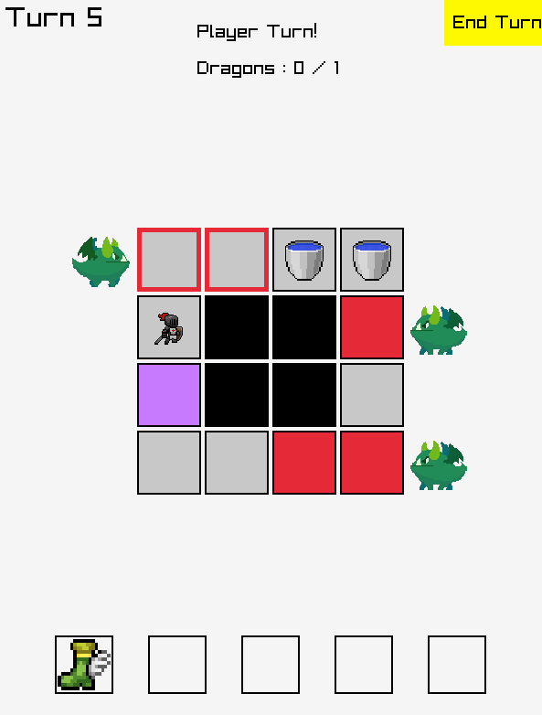
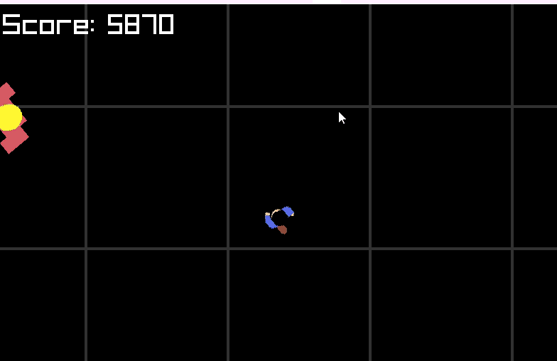
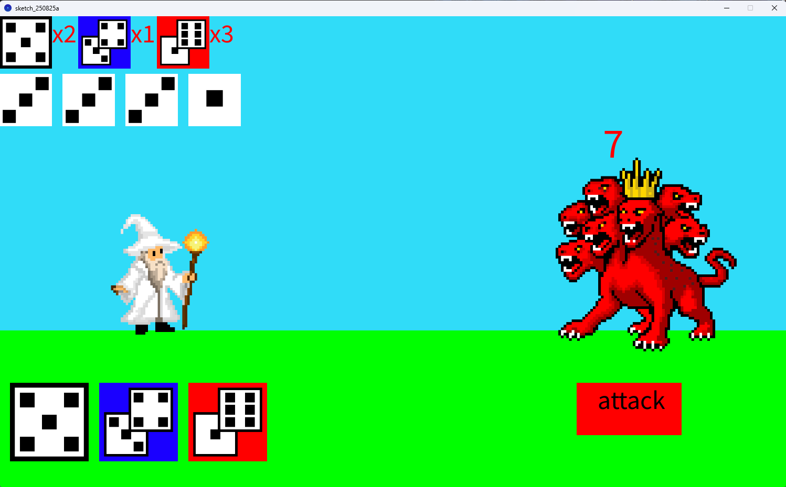

# DigiPen Korea Game Jam Aug 2025

## Theme

> One Time Use

## Submitted Games

### Square Game No Way Back

#### Names of team members

Rudy Castan - Programmer  
Shinyu Castan - Game Designer / Level Designer  
Hayu Castan - Artist / Voice Actor  

#### Brief Intro to Game

In our game you move and jump around to find the purple item. Once you have that then you can complete the level by going to brown exit door. However you **can't go left!** 

There are one time use power ups that you go left for mere seconds. Use them wisely!

Watch out for the red lava! Don't fall off the platforms!

You can also use the built in editor to paint out your own levels!

#### How to interact with the Game

**Game Mode**  
Left/Right arrows - to move left & right  
Up arrows - to jump!  
1, 2, 3, 4, 5 Keys - Go left power ups  

**Create Mode**  
Mouse press to paint the current tile  
Keyboard **p** - **Toggle between playing and editing the level**  
Keyboard **1** - Paint **Ground** tiles  
Keyboard **2** - Paint **Decoration** tiles  
Keyboard **3** - Paint **Spawn Points** tiles (the game will randomly pick one to spawn from)  
Keyboard **4** - Paint **Trap** tiles (Lava Ground!)  
Keyboard **5** - Paint **Item** tiles (the game will randomly pick one to spawn from)  
Keyboard **6** - Paint **Door** tiles (where to go to beat the level if the item has been found)  
Keyboard **7** - Paint **Bouncy** tiles (bounce the player up, down, left, right)  
Keyboard **8** - Paint **Bouncy Ramps** tiles (bounce the player diagonally up)  
Keyboard **0** - **Erase** tiles  

On the bottom left is a dropdown to pick which level to edit.

On the bottom right is a dropdown to pick which size of level to have when the `New Level` button is pressed.

Use the `Save Level` to save your work.

Be careful of `Delete Current Level`

`Main Menu` will you take you back to the games main menu

`Download Level` actually downloads all the levels as a JSON string.

#### Describe how the game reflects the theme

You can only go left with **One Time Use** power ups!

[Play it Online here!](aug/square_game_no_way_back/game/index.html)

### Piheyot's Dragon Strike

**Piheyot - Seungmin Hong**

You as a knight have to take down all the dragons of the infinite grid and move far as you can.

Game Start : Enter  
Game Retry : R  

Ending Turn, Using Item : Mouse Left-Click  
Player Movement : WASD  

You can use items by mouse left-click and another mouse click to your designated tile.

WaterBucket : Makes the tile 'soaked', where dragon can't attack for 1 turn and can take away fire.

Boots : Can jump 2~3 tiles, but only in directions that you can face

Teleport : Can teleport to any tile you choose.

The tiles are only one-time use, and becomes purple, which will magically disappear when a turn gets skipped. You have to make sure you don't get caught by the tiles you've went through, while taking down all dragons.

[Download Game](aug/Piheyot/Dragon%20Striker.zip)

### Don't Stop the Party

Names of team members

Solo Leveling  
-Seungju Song

Brief Intro to Game  
-Wander around the party, and use popper to people to celebrate.

How to interact with the Game  
-Change direction with A, D button  
-Use popper with Enter  
-Slow down the speed with Spacebar  

Describe how the game reflects the theme  
-The popper is only one time use, if you celebrate people with popper they give you one more.

[Download Game](aug/solo_leveling/Don't%20stop%20the%20party.zip)

### One Way

<video width="1402" height="1374" controls>
  <source src="aug/3_stacks/20250829-0556-50.4195271.mp4" type="video/mp4">
</video>

Objective: Reach the door by solving puzzles

One way can't go back  
theme : one time use

Members  
Munjun Kim  , Hongjip Kim , Yohan Lim

about theme and this game

when choose the theme with 'one time use', we think 한붓그리기 is best representation of this theme  
so we make bridge and item can be used one time  
you should apprehend the level, use item, and find the goal!

about game

you are on the way through the fragile bridges to find cheese!  
find the key, find correct way, and go on adventure to find cheese!

How to play

please double click gamejam.exe file!

Move : W  , A , S , D  
Interect : E  
Pick up item : F  
Reset level : R  
Ability(teleport) : Spacebar.  

[Download Game](aug/3_stacks/one%20way%20can't%20go%20back.zip)

### Shin Ha-won

