# DigiPen Korea Game Jam Feb 2025

## Theme

> Find it, Protect it

## Submitted Games

### Doppleganger

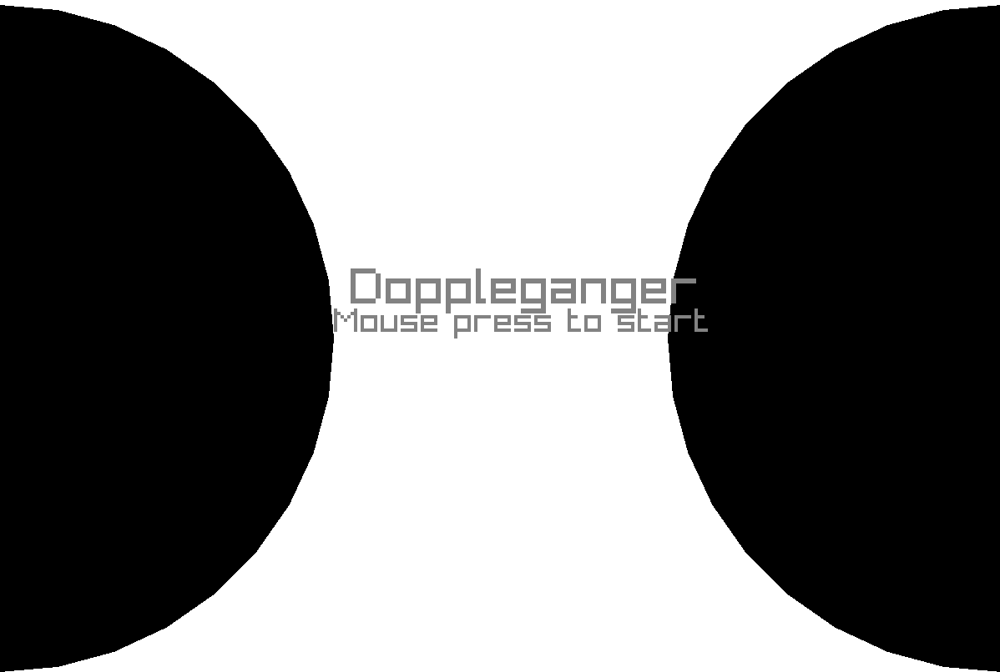

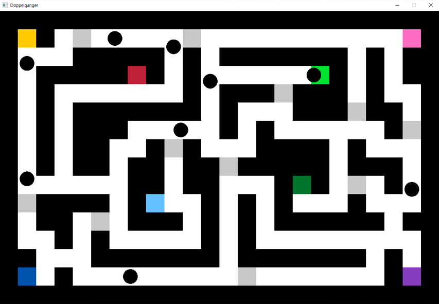

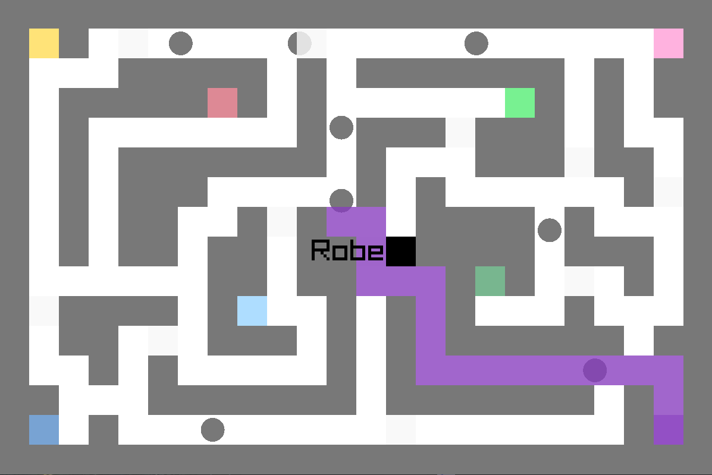

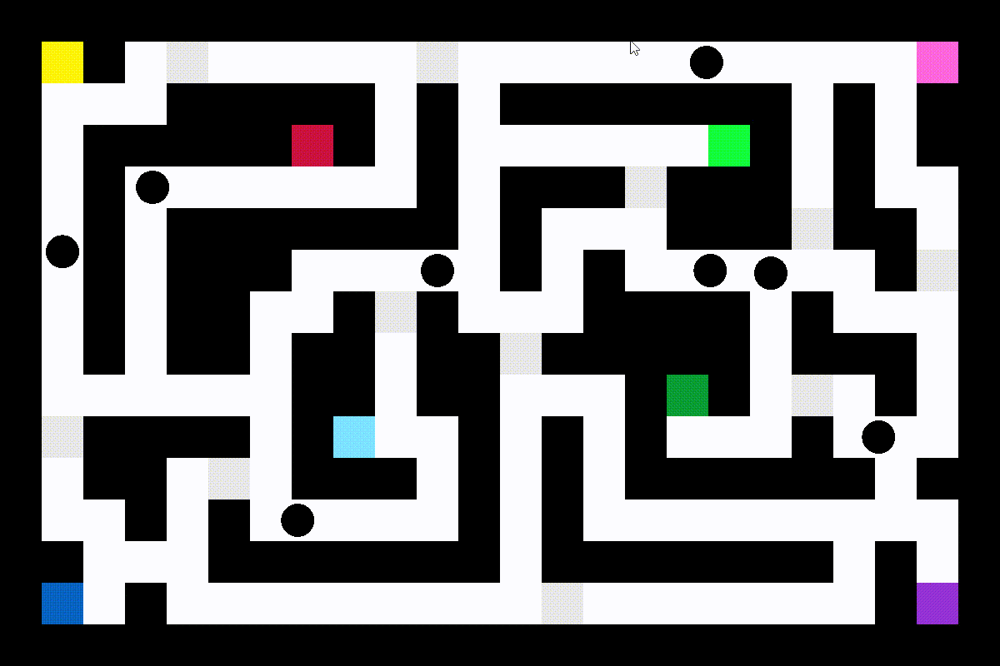

- Donghyeon Jo
- Junseok Lee

- When the game starts, NPCs are generated in each of the 8 rooms. 
- Each NPC has a name and a destination room.
- At the beginning, one of the 8 NPCs is a 'doppelganger', and the name is the same as one of the remaining 7 NPCs.
- If an NPC with the same name meets a doppelganger, it is game over. And you will return to the main menu.
- You can check the name and the route to the destination by clicking mouse on the NPCs.
- Light gray is an open door, dark gray is a closed door. Click to toggle.
- The doppelgangers have part of their names hidden. And Doppelgangers spawn in random rooms at regular intervals.

- Once the NPCs reach the destination room, they will decide on a new destination room.
- Each NPC judges the status of the doors in the entire map differently and tracks the shortest path to the destination room, and when the NPC discovers a new door that is open or closed, the optimized path is recalculated (you can check the status of the doors in the map from the NPC's perspective by clicking on the NPC also).
- The doppelgangers have different names when they reach the destination room.

- 'Find' the doppelgangers, guess its name, remember them, and 'protect' the NPCs by opening and closing the doors at the right time!

[Windows Version](feb/Doppleganger/Doppleganger.zip)

### Castle Defense

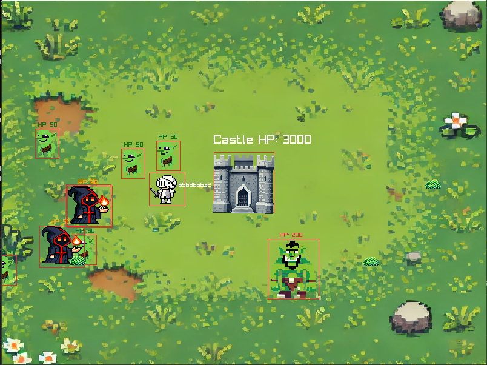

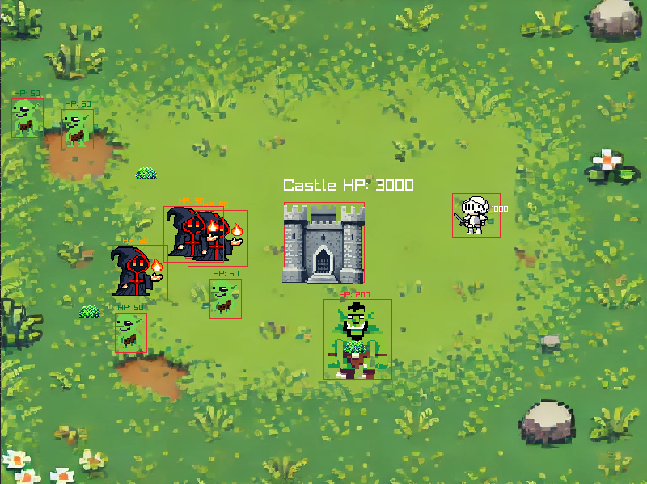

Jiyun Seok  
Donghyeon Jo  

We made a towerdefense game which includes find and protect

In game, the player will move around the castle, protecting the castle from monsters

There are five bushes which randomly spawned in the map

The player should find the camoflaged bushes and acquire items.

Mace which ends the game is also included in item packages.

We tried to add protect components by using gems, but chased by the time, we couldn't made it  
But we added finding component as using bushes.  
This was my first game jam event, though I was shy during game jam, this winter game jam really helped me a lot. I could experience more team projects, studying last semester thing and made compassion about making games.  
Thank you Mr.Rudy, I'd really like to join next gamejam as a better person!!  

[Windows Version](feb/gamejam2025winter-castledefense/gamejam2025winter-castledefense.zip)

### Omegarudy

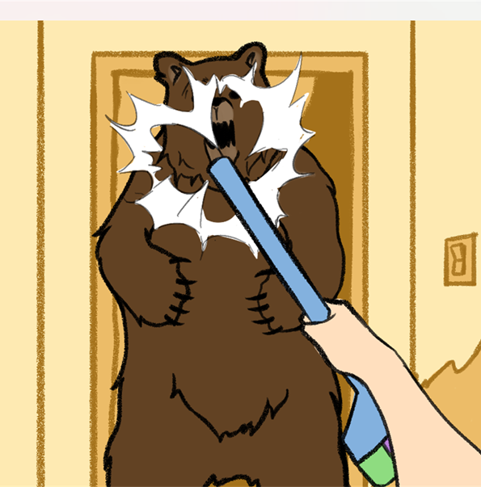

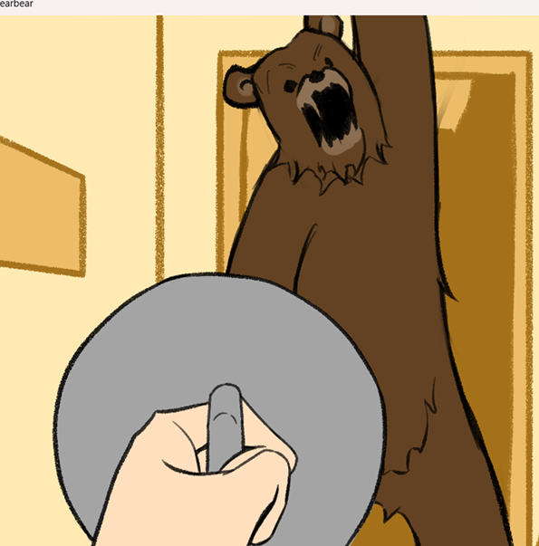

Team OmegaRudy (Seungju Song & Chanwoong Moon)

A bear is coming to your home, you must find items and protect your home and yourself in few seconds.

This game has 2 phase.

The first phase is finding items in home, just move to next room with A, D buttons and click it to collect.

Then, in second phase, fight with bear. 
In this phase, player will fight will the item it found.
Such as pot lid, broom, and so on.

[Windows Version Here](feb/gamejam2025winter-omegarudy/gamejam2025winter-omegarudy.zip)

### Square Game

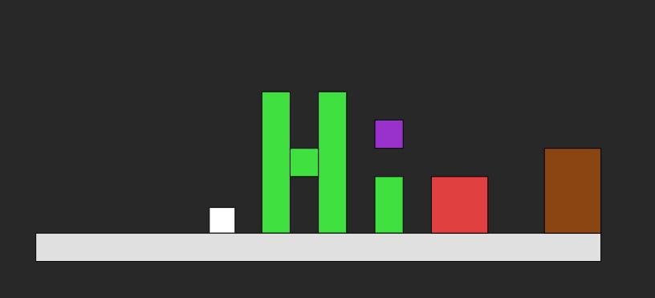

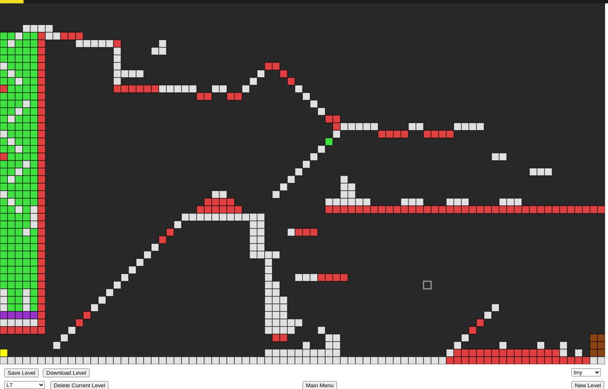

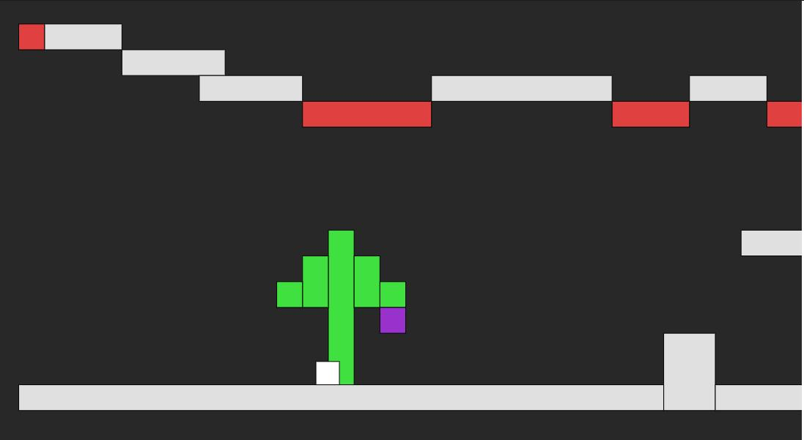

#### Names of team members

Rudy Castan - Programmer  
Shinyu Castan - Game Designer / Level Designer  
Hayu Castan - Artist / Voice Actor  

#### Brief Intro to Game

In our game you move and jump around to find the purple item. Once you have that then you can complete the level by going to brown exit door. Watch out for the red lava! Don't fall off the platforms!

You can also use the built in editor to paint out your own levels!

#### How to interact with the Game

**Game Mode**  
Left/Right arrows - to move left & right  
Up arrows - to jump!  

  keyReleased() {
    if (key === " " || key === "0") {
      this.tileMode = EMPTY;
    } else if (key === "1") {
      this.tileMode = GROUND;
    } else if (key === "2") {
      this.tileMode = DECOR;
    } else if (key === "3") {
      this.tileMode = SPAWN;
    } else if (key === "4") {
      this.tileMode = TRAP;
    } else if (key === "5") {
      this.tileMode = ITEM;
    } else if (key === "6") {
      this.tileMode = DOOR;
    }
  }

**Create Mode**  
Mouse press to paint the current tile  
Keyboard **p** - **Toggle between playing and editing the level**  
Keyboard **1** - Paint **Ground** tiles  
Keyboard **2** - Paint **Decoration** tiles  
Keyboard **3** - Paint **Spawn Points** tiles (the game will randomly pick one to spawn from)  
Keyboard **4** - Paint **Trap** tiles (Lava Ground!)  
Keyboard **5** - Paint **Item** tiles (the game will randomly pick one to spawn from)  
Keyboard **6** - Paint **Door** tiles (where to go to beat the level if the item has been found)  
Keyboard **0** - **Erase** tiles  

On the bottom left is a dropdown to pick which level to edit.

On the bottom right is a dropdown to pick which size of level to have when the `New Level` button is pressed.

Use the `Save Level` to save your work.

Be careful of `Delete Current Level`

`Main Menu` will you take you back to the games main menu

`Download Level` actually downloads all the levels as a JSON string.

#### Describe how the game reflects the theme

The purple item must be found and can only be protected by taking it to the exit of the level!

[Play it Online here!](feb/Square_Game/index.html)

